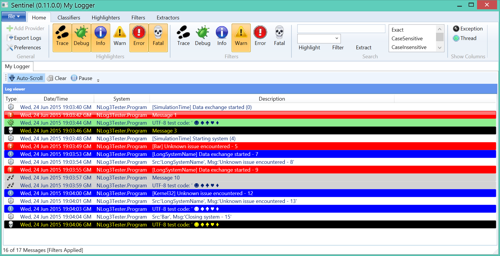
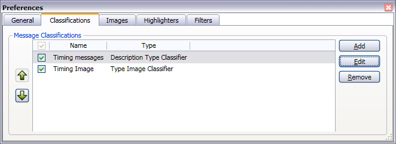
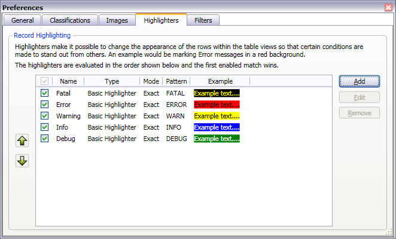

#  sentinel
Log-viewer with filtering and highlighting



## Log Sources 
Sentinel is a viewer for log-files - specifically I designed it to act as a network end-point for the likes of nLog and log4net, additionally it then works really well for capturing log entries from multiple sources.  

Source                | Status
--------------------- | ------
Log4Net UdpAppender   | Supported 
nLog's nLogViewer     | Supported
Trace Listener        | Planned
Log-File Watcher      | Experimental
Custom, via plug-in   | Planned
MSBuild               | Plug-in in source-repo

## Command-Line usage
There are command line options that allow control over Sentinel when started, options available include the following:
* Loading of a saved Session File
* nLog network listener
* log4net network listener

## Command line options
If no command line options are specified, the standard New Session wizard will launch at start-up.

### Launch with NLog listener enabled
```
sentinel nlog [-p portNumber](-p-portNumber) [-udp](-tcp)
```
Defaults to port 9999 and Udp if not specified.

### Launch with Log4Net listener enabled
```
sentinel log4net [-p portNumber](-p-portNumber) 
```
Defaults to port 9998 if not specified.

### Launch with previously saved session file
```
sentinel filename.SNTL
```

## nLog's NLogViewer target configuration
To allow a nLog based application transmit its log messages to Sentinel, use a configuration like the one shown below:
```xml
<?xml version="1.0" encoding="utf-8" ?>
<nlog xmlns="http://www.nlog-project.org/schemas/NLog.xsd"
      xmlns:xsi="http://www.w3.org/2001/XMLSchema-instance">
  <targets>
    <target xsi:type="NLogViewer"
            name="viewer"
            address="udp://127.0.0.1:9999"/>
  </targets>
  <rules>
    <logger name="*"
            minlevel="Debug"
            writeTo="viewer" />
  </rules>
</nlog>
```

### Showing nLog debug information (0.12.0.0 onwards)
If the above configuration is adjusted to enable {{includeSourceInfo}} then it is possible to see the file, class, method and line number corresponding to where the message is emitted.  Some of this information is only reported if the source program is compiled in DEBUG mode (e.g. RELEASE mode strips this information)
```xml
<target name="viewer"
        xsi:type="NLogViewer"
        includeSourceInfo="true"
        address="udp://127.0.0.1:9999" />
```

## Log4Net UdpAppender configuration
To allow a log4net application transmit its log messages to Sentinel, use a configuration like the one shown below:
```xml
<?xml version="1.0" encoding="utf-8" ?>
<configuration>
  <configSections>
    <section name="log4net"
             type="log4net.Config.Log4NetConfigurationSectionHandler, log4net"/>
  </configSections>

  <log4net>
    <appender name="udp"
              type="log4net.Appender.UdpAppender">

      <RemoteAddress value="127.0.0.2"/>
      <RemotePort value="9999"/>
      <layout type="log4net.Layout.XmlLayout"/>
      <encoding value="utf-8" />
    </appender>

    <root>
      <appender-ref ref="udp"/>
    </root>
  </log4net>
</configuration>
```
### Showing log4net debug information (0.12.1.0 onwards)
If the above configuration is adjusted to enable {{locationInfo}} then it is possible to see the file, class, method and line number corresponding to where the message is emitted.  Some of this information is only reported if the source program is compiled in DEBUG mode (e.g. RELEASE mode strips this information)
```xml
<layout type="log4net.Layout.XmlLayout">
    <locationInfo value="true" />
</layout>
```

## Log Entries
Log file entries map the the following interface.  This is core record for a log-file entry and used to populate the columns within the live-log view.  Note, by using [Classifiers](#Classifiers) it is possible to rearrange and/or change the content of these fields upon receiving a new log-entry.

```c#
public interface ILogEntry
{
    string Classification { get; set; }
    DateTime DateTime { get; set; }
    string Description { get; set; }
    string Source { get; set; }
    string System { get; set; }
    string Thread { get; set; }
    string Type { get; set; }
}
```

Log entries may be classified, highlighted and filtered based upon special services:
* Classifiers can change the properties of a log entry
* Highlighters can change its appearance.
* Filters can be used to suppress the displaying of matching entries.

## Classifiers
Upon receiving a new log-entry it is processed through registered classifiers.  Classifiers have the ability to rewrite the log-entry prior to passing it to the visualisation aspect of Sentinel. 

As an example, suppose the incoming message when starting with the phrase "Sleeping for another" is intended to be switched from its supplied type (e.g. DEBUG or INFO) to its own type **Timing**.  The ClassifierViewModel registers this on construction.  Note that the regular expression below also rewrites the Description to the named-capture _description_, effectively stripping off the prefix "Sleeping for another" - information no longer needed due to the reclassification.

```c#
items.Add(
	new DescriptionTypeClassifier("Timing", "Timing")
		{
			Enabled = true,
			Name = "Timing messages",
			RegexString = @"^Sleeping for another (?<description>[^$](^$)+)$"
		});
```

In addition to reclassifying messages, the Classifier mechanism is currently used to make other changes to the message appearance.  Continuing the example above, using a {{TypeImageClassifier}} it is possible to specify the image to be used for entries with a type of **Timing**.

```c#
items.Add(
	new TypeImageClassifier("Timing", "/Resources/Clock.png")
		{
			Enabled = true,
			Name = "Timing Image",
		});
```
The classifiers can be seen in the Preferences dialog-box.


## Highlighters
Customisable and extendible highlighters that may be toggled on and off during live preview.  The current implementation limits pattern matching to the Type and System fields, although this will be extended to all fields.  An example of why this is useful, in the classifiers section above, a new type of "Timing" was added, this type can get its own highlighting style.  



Highlighters can match the contents of the Type and System fields
* Exact Strings
* Substrings
* Regular Expressions


If the matching field is set to **Type** an the match string specified as "Timing", a new highlighter for the timing can be added.  User-defined highlighters are automatically added to the toolbar for ease of enabling and disabling of the highlighting.  


The highlighters work on a first-come, wins principle.  Therefore, the order of the entries in the highlighters section of the Preferences dialog-box are important.  It is possible to hide the highlighting of  FATAL messages if a highlighter is positioned before FATAL and gets a match.

## Filters
Filters are very much like highlighters except their purpose is to remove log-entries from the displayed values (note, the values are not lost, just hidden).  Filters may be toggled on and off during the session.  Filters are evaluated in the order specified, but since filters works on an any-match = hide principle the evaluation stops on the first match, resulting on the entry being hidden.  Note, this means that messages displayed have travelled through ALL of the filters without being matched, this isn't a cost free aspect, so be careful about how many enabled filters you have!

## Extractors
Extractors are the inverse of Filters, log entries must match the extractor to be visible.  This can be very useful if you, for example, define an extractor for a specific logging condition and want to quickly see if and how often it happened.
